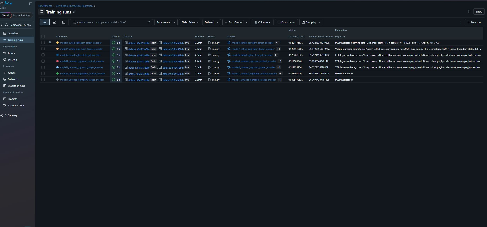
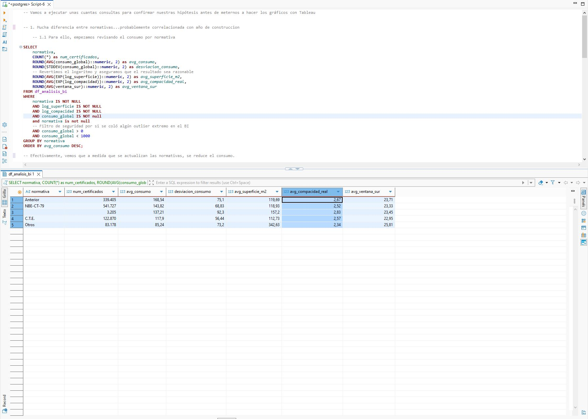
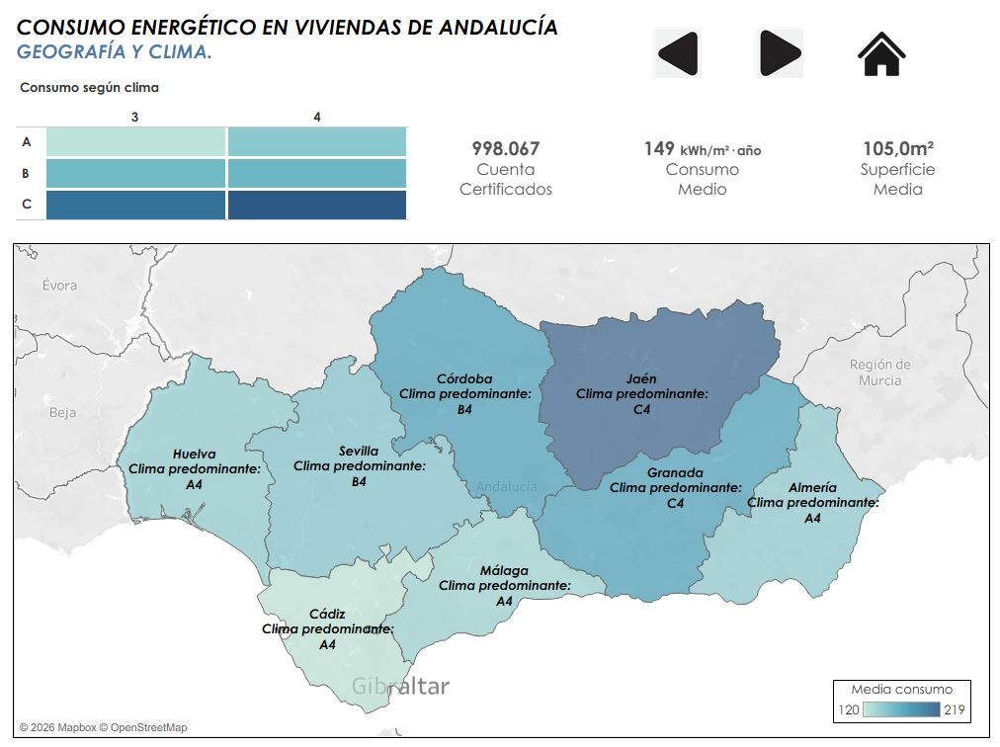
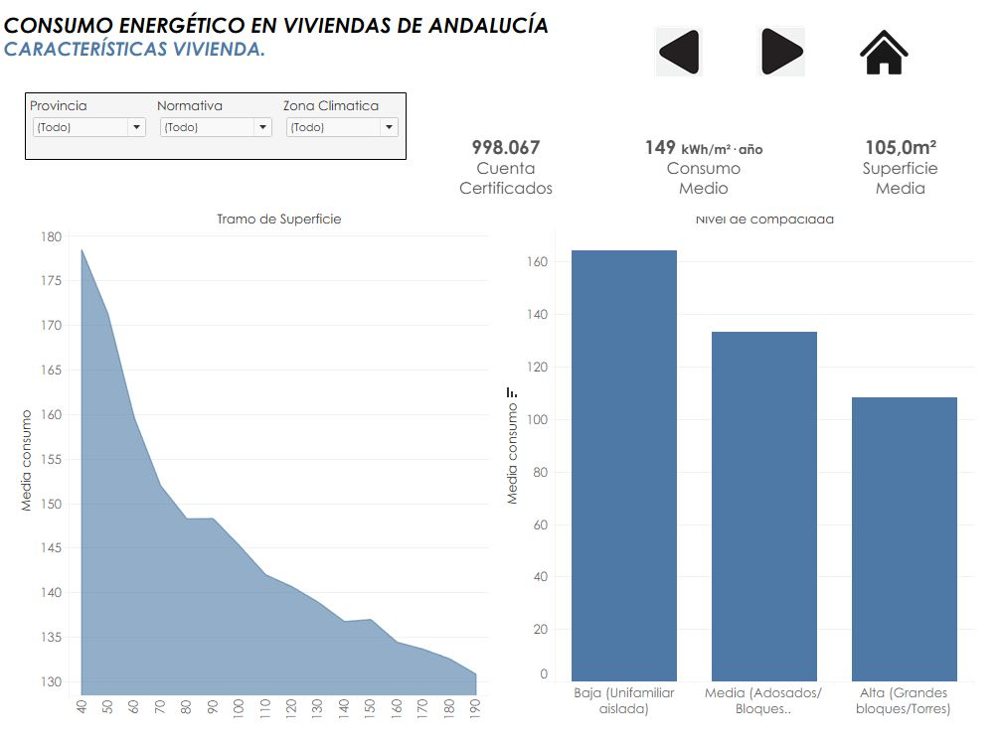
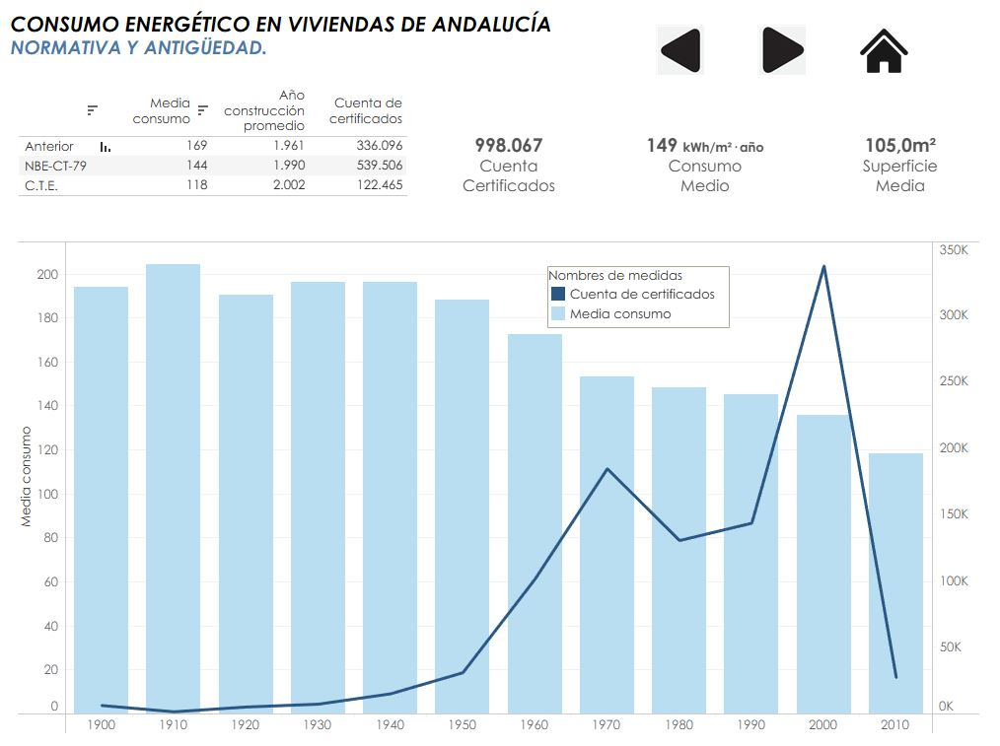

# ⚡ Análisis de Eficiencia Energética en Andalucía

Este proyecto combina técnicas de **Data Engineering**, **Machine Learning** y **Business Intelligence** para analizar y predecir el consumo energético de los edificios en las 8 provincias de Andalucía, basándose en los Certificados de Eficiencia Energética oficiales.

---

## 🏗️ 1. Ingesta de Datos y ETL

El núcleo de la información proviene de un dataset masivo de certificados energéticos en formato **XML** obtenido directamente de la Junta de Andalucía. El formato y la cantidad de registros supusieron un reto técnico en cuanto a procesamiento y limpieza.

### 📥 Origen de los datos
* **Fuente:** Registros oficiales de la Junta de Andalucía.
* **Volumen:** ~1.200.000 registros procesados.
* **Cobertura:** Almería, Cádiz, Córdoba, Granada, Huelva, Jaén, Málaga y Sevilla.

## 🧹 2. Pre-procesado y Estructuración (Data Wrangling)

El dataset se dividió en cinco entidades relacionales para facilitar un primer análisis general, limpieza de variables con practicamente todos los registros nulos, etc... Se analizan 5 dataframes: **Características, Demandas, Consumos, Emisiones y Clasificaciones**.

## 🤖 3. Estudio de Viabilidad y Selección de Modelo (AutoML)

Se realizó una fase de experimentación utilizando **PyCaret** para evaluar la calidad de los datos y determinar la estrategia de predicción más efectiva.

### 📊 Resultados y Decisiones Técnicas
* **Selección de Target:** Se priorizó la **Regresión de Consumo** para obtener mayor granularidad.
* **Superación del Baseline:** El modelo final desarrollado manualmente superó significativamente los resultados obtenidos por el AutoML.

## 🧼 4. EDA Profundo y Depuración de Datos

Filtrado exhaustivo para transformar el dataset bruto en un conjunto de datos de alta calidad, aplicando reglas de negocio y criterios técnicos.

Se estudiaron todas las variables, sus correlaciones, se detectaron missings no declarados, errores en los registros, cambios de tipo de dato, etc...

### 📊 Filtrado por lógica de negocio

Tras realizar algún análisis y modelo con malos resultados, se detecta que hay dos poblaciones diferentes (grandes superficies y viviendas). Se toma la decisión de que se deben estudiar independientemente, por lo que se aplican filtros de tipo de vivienda y superficie. La gran mayoría de registros se corresponden con viviendas pequeñas, así que ese será el grupo de estudio.

### 📈 Ingeniería de Variables (Feature Engineering)
* **Transformación Logarítmica:** Aplicada a superficie y compacidad para paliar la gran asimetría detectada.
* **Codificación Categórica:** Target Encoding y Ordinal Encoding. Algunas variables categóricas se limpian o agrupan estratégicamente para conseguir una cardinalidad adecuada.

## ⚙️ 5. Desarrollo del Modelo y Pipeline de Producción

### 🏆 Entrenamiento Final y Ensamble
Se probaron varias configuraciones de modelos **XGB** y **LGBM**, y hasta se introdujo un **Voting Regressor** combinando ambos. Todos los modelos y sus configuraciones y métricas se registraron mediante MLFlow.

*Gráfico de importancia de variables donde destaca la Compacidad y el Año de Construcción.*

.png)
*Gráfico de importancia de variables donde destaca la Compacidad y el Año de Construcción.*

### 🚀 Inferencia y Aplicación (`app.py`)
Interfaz web interactiva desarrollada con **Gradio**.

## 🗄️ 6. Validación de Hipótesis y SQL

Validación de tendencias mediante consultas directas para asegurar la coherencia física de los datos.

## 📊 7. Visualización y Business Intelligence (Tableau)

El proyecto culmina con un Dashboard interactivo en **Tableau**.

### 🌐 Análisis Geográfico y Climático

### 🏠 Características de la Edificación y Evolución

### 📈 Evolución temporal

### 💡 Conclusiones del Proyecto
1. **Predominancia de la Envolvente:** El modelo de Machine Learning y el análisis SQL coinciden: la Compacidad y el Aislamiento (Normativa) tienen un impacto superior en el consumo que la ubicación geográfica. Un edificio mal diseñado en Málaga puede consumir más que uno eficiente en Granada.

2. **El éxito del CTE:** Se observa un "escalón" de eficiencia claro. Los edificios construidos bajo el Código Técnico de la Edificación (post-2006) reducen el consumo medio en más de un 40% respecto a la edificación anterior a 1979, validando el éxito de las políticas de eficiencia.

3. **Segmentación de Poblaciones:** Durante el EDA se descubrió que el comportamiento energético de las grandes superficies (terciario) y las viviendas es diametralmente opuesto. Centrar el modelo exclusivamente en el sector residencial permitió reducir el error (MAE) drásticamente, logrando una herramienta de predicción mucho más fiable para el ciudadano.

4. **La Geografía del Consumo:** Se confirma una "brecha térmica" clara entre el litoral y el interior. Las provincias con climas de mayor severidad invernal (Granada, Jaén y zonas de Córdoba) presentan consumos base sistemáticamente más altos, independientemente de la calidad constructiva. El clima actúa como un multiplicador de ineficiencias.

5. **Inversión de la Demanda:** Mientras que en el imaginario colectivo Andalucía es "calor", los datos demuestran que el consumo global está traccionado por la calefacción en invierno. Las viviendas en zonas climáticas C y D (según CTE) son las que más penalizan el sistema energético andaluz, lo que sugiere que las políticas de rehabilitación deben priorizar el aislamiento térmico frente al frío.

Además, hemos creado un modelo para predecir los consumos de viviendas en Andalucía que se comporta bastante bien:
* Con un  R²=0.53 explicamos más de la mitad de la variabilidad del consumo energético en Andalucía. No es un R² muy bueno, pero teniendo en cuenta que normalmente son datos con altos niveles de ruido, es un resultado aceptable. También influye en el porcentaje de variabilidad que no explica el modelo que existen muchos factores no observados (uso real de cada propietario, hábitos de consumo, si se ventila o no la casa, si se dejan ventanas abiertas, etc..)
* Sin un modelo, utilizando únicamente la media (baseline) el error medio es de 57 kWh/m². El error medio de nuestro modelo es de 36 kWh/m², lo que supone una mejora del 37%.
* Hemos capturado patrones estructurales del consumo energético a partir de variables como compacidad, año de construcción o clima, que tienen un impacto real y medible.

**NOTA:** Para poder probar el código, se han creado archivos .csv de muestra con un 30% de los datos, ya que los originales pesaban 150MB cada uno.